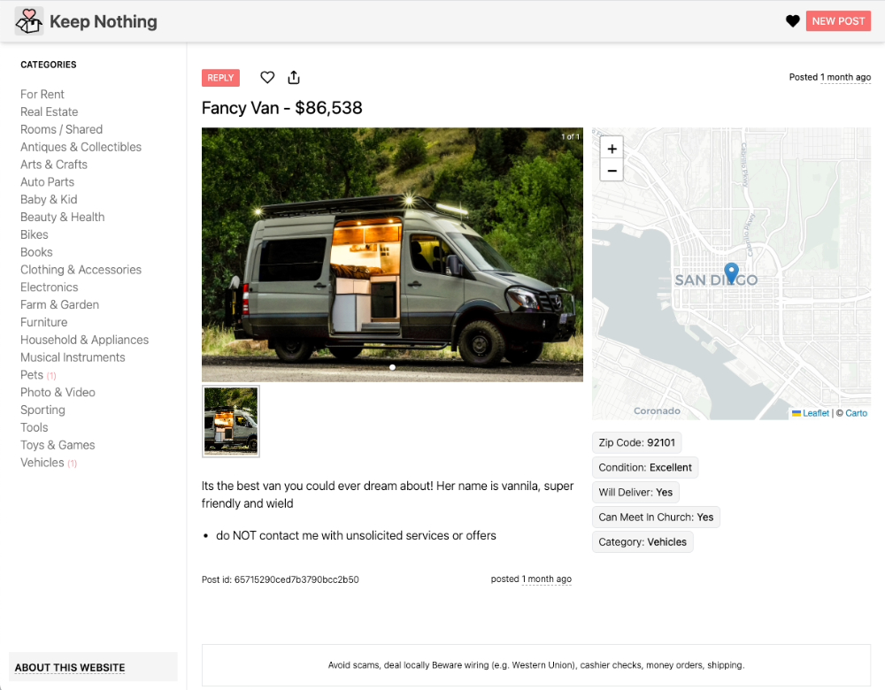

# keep-nothing

A web app for selling and giving away stuff you don't need. Intended for use among local churches within the San Diego community.

Live at 🚀 [keep-nothing.com](https://keep-nothing.com/).

## Development

Built on

- [Next.js](https://nextjs.org/) + [React](https://reactjs.org/)
- [TypeScript](https://www.typescriptlang.org/)
- [Tailwind CSS](https://tailwindcss.com/)
- [MongoDB](https://www.mongodb.com/)

✨ Contributions are warmly welcomed! ✨

If you want to contribute, please read the [Contributing](docs/Contributing.md) guide. If you are not a developer, you can still contribute by [reporting bugs](/issues/new?assignees=&labels=bug&template=bug_report.md&title=) or [suggesting features](/issues/new?assignees=&labels=enhancement&template=feature_request.md&title=).

## Folder Structure

- `.github` - GitHub issue templates
- `.vscode` - Specific IDE settings for [VS Code](https://code.visualstudio.com/)
- `app` - The keep-nothing web app (Next.js)
- `database` - Seed files for the database
- `docs` - Documentation
- `public` - Static files served by the app
- `scheduling` - Scripts for scheduling automated cron tasks
