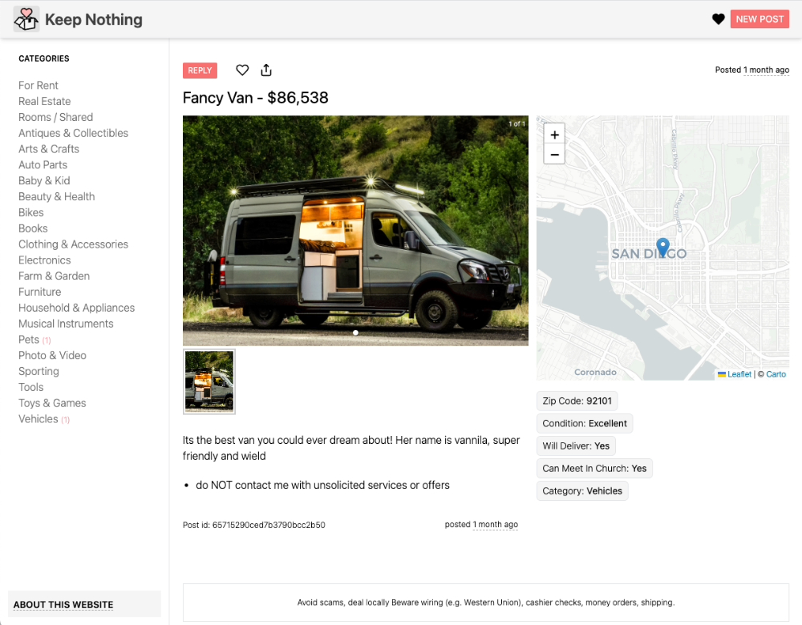

# keep-nothing

A web app for selling and giving away stuff you don't need. Intended for use among local churches within the San Diego community.

Live at 🚀 [keep-nothing.com](https://keep-nothing.com/).

## Development

Built on

- [Next.js](https://nextjs.org/) + [React](https://reactjs.org/)
- [TypeScript](https://www.typescriptlang.org/)
- [Tailwind CSS](https://tailwindcss.com/)
- [MongoDB](https://www.mongodb.com/)

✨ Contributions are warmly welcomed! ✨

If you want to contribute, please read the [Contributing](docs/Contributing.md) guide. If you are not a developer, you can still contribute by [reporting bugs](/issues/new?assignees=&labels=bug&template=bug_report.md&title=) or [suggesting features](/issues/new?assignees=&labels=enhancement&template=feature_request.md&title=).

## Folder Structure

- `.github` - GitHub issue templates
- `.vscode` - Specific IDE settings for [VS Code](https://code.visualstudio.com/)
- `app` - The keep-nothing web app (Next.js)
- `database` - Seed files for the database
- `docs` - Documentation
- `public` - Static files served by the app
- `scheduling` - Scripts for scheduling automated cron tasks

db.posts.updateMany({}, { $set: { isExpired: false, createdDate: new Date() } })

## 📄 License

[GPLv3 License](./License)

tasks
<!-- - check for mistakes -->
<!-- - protect master branch -->
<!-- - make repo public -->
- post on the rock
- post on clist?

<!-- - create github issues from readme -->
<!-- - add license -->
<!-- - fix .com name -->
<!-- - change /api/posts to /api/post -->
<!-- - gather categories + conditions + neighborhoods -->
<!-- - fix neighboorhood position -->
<!-- - rename imageUrl to images -->
<!-- - add counts to categories -->
<!-- - add liked heart to post card as absolute position -->
<!-- - compress images + remove orphaned images -->
<!-- - fix newlines in description -->
<!-- - consistent file names -->
<!-- - favicon / logo -->
<!-- - about/donate page -->
<!-- - add a template for github bug reports -->
<!-- - posts need to expire!!! -->

<!-- - support themes (dark/light) -->
<!-- - use a better image service -->
<!-- - allow email / phone hide => email relay -->
<!-- - add slugs to urls -->
<!-- - add accounts? -->

- change form create to not be client side //////// maybe will
keep because of form validation?
